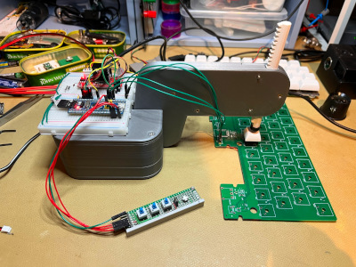
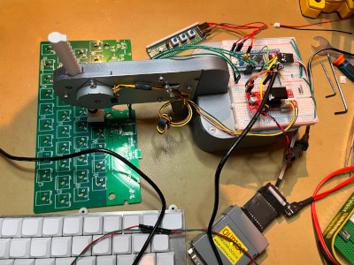

Keypecker
=========

"Keypecker" is a device for measuring key/button switch response speed and
reliability. It uses a stepper motor to (repeatedly) move an actuator rod up
and down, and records the time from the start of the movement to a signal edge
on one or more digital inputs (channels), for each such movement (pass).

[](proto_front.jpeg)
[](proto_back.jpeg)

Keypecker can be used to characterize both physical switches and response of
devices controlled by switches, provided they report events as digital signal
edges.

The device firmware is based on the Zephyr RTOS.

Keypecker is controlled via a TTL-level USART using an interactive shell with
an assortment of supported commands (including stock Zephyr commands):

```
  acquire  :Acquire a timing measurement on all enabled channels for specified
            number of passes (default 1)
  adjust   :Adjust the "current" (default), "top", or "bottom" actuator
            positions interactively
  check    :Check reliability of all-channel triggering between the top and
            bottom positions, over the specified number of passes (default is
            one)
  clear    :Clear screen.
  device   :Device commands
  devmem   :Read/write physical memory
            Usage:
            Read memory at address with optional width:
            devmem address [width]
            Write memory at address with mandatory width and value:
            devmem address <width> <value>
  down     :Move actuator down (n steps)
  get      :Get parameters
  help     :Prints the help message.
  history  :Command history.
  kernel   :Kernel commands
  measure  :Acquire a timing measurement on all enabled channels for specified
            number of passes (default 1), and output "brief" (default), or
            "verbose" results
  off      :Turn off actuator
  on       :Turn on actuator
  print    :Print the last timing measurement in a "brief" (default) or
            "verbose" format
  resize   :Console gets terminal screen size or assumes default in case the
            readout fails. It must be executed after each terminal width
            change to ensure correct text display.
  set      :Set parameters
  setup    :Make sure the actuator is on, and setup top and bottom positions
            specified number of steps (default 1) around the trigger point.
            Verify trigger with specified number of passes (default 2).
  shell    :Useful, not Unix-like shell commands.
  swing    :Move actuator back-n-forth within n steps around current position,
            until interrupted
  tighten  :Move the top and bottom positions within the specified number of
            steps (default 1) around the trigger point. Verify trigger with
            specified number of passes (default 2).
  up       :Move actuator up (n steps)
```

Here's an example session beginning at the power-on, configuring two channels
to detect pressure and release of a directly-connected key switch (Cherry MX
Brown), setting up the top and bottom positions tightly around the trigger
point, verifying that the trigger is reliable through 32 passes, and then
measuring timing of 256 passes (half down, and half up):

```
*** Booting Zephyr OS build zephyr-v3.3.0-474-geead89e7f22d ***


keypecker:~$ resize
keypecker:~$ set ch 0 down rising DOWN
keypecker:~$ set ch 1 up falling UP
keypecker:~$ setup
Actuator is off.
Move the actuator manually to a point above the trigger, and press Enter.
Press Ctrl-C to abort.

Actuator is on.
The current position is the top.
Moving one step down.
Press up and down arrow keys to move the actuator to a point below the
trigger, and press Enter.
Press Ctrl-C to abort.

Bottom position is set.
Tightening around the trigger point.
Press Ctrl-C to abort.

Setup complete.


keypecker:~$ check 32
100%


keypecker:~$ measure 256
                      #0              #1
                    DOWN              UP
-------- --------------- ---------------
    Both           Value           Value
-------- --------------- ---------------
Trigs, %            +100            +100
 Min, us           +2680           +1900
Mean, us           +2800           +1930
 Max, us           +2920           +1960
-------- --------------- ---------------
    Time        Triggers        Triggers
-------- --------------- ---------------
Both, us 0           105 0           128
         |             : |_____________:
    1900 |             : |_____________|
    1963 |             : |             :
    2026 |             : |             :
    2089 |             : |             :
    2152 |             : |             :
    2215 |             : |             :
    2278 |             : |             :
    2341 |             : |             :
    2404 |             : |             :
    2467 |             : |             :
    2530 |             : |             :
    2593 |_            : |             :
    2656 | |___________: |             :
    2719 |_____________| |             :
    2782 |             : |             :
    2845 |             : |             :
    2908 |             : |             :
-------- --------------- ---------------


keypecker:~$
```

The plus `+` signs before the measured numbers indicate overcapture
(bouncing), which is normal for physical switches.

Here's another session. This time a USB keyboard is tested. It signals the
detection of a key pressure/release on the rising edge, and the report of that
event over USB, on the falling edge, using a single wire. That is connected to
two channels - one detecting rising, another - falling edges. After the setup
of the trigger point, and a check of 16 triggers, a measurement of 256 passes
is taken:
```
*** Booting Zephyr OS build zephyr-v3.3.0-474-geead89e7f22d ***


keypecker:~$ resize
keypecker:~$ set ch 0 both rising DETECT
keypecker:~$ set ch 1 both falling REPORT
keypecker:~$ setup
Actuator is off.
Move the actuator manually to a point above the trigger, and press Enter.
Press Ctrl-C to abort.

Actuator is on.
The current position is the top.
Moving one step down.
Press up and down arrow keys to move the actuator to a point below the trigger, and press Enter.
Press Ctrl-C to abort.

Bottom position is set.
Tightening around the trigger point.
Press Ctrl-C to abort.

Setup complete.


keypecker:~$ check 16
100%


keypecker:~$ measure 256
                      #0              #1
                  DETECT          REPORT
-------- --------------- ---------------
    Both           Value           Value
-------- --------------- ---------------
Trigs, %             100             100
 Min, us            6080           12500
Mean, us           14320           20500
 Max, us           22560           28500
-------- --------------- ---------------
    Time        Triggers        Triggers
-------- --------------- ---------------
Both, us 0            49 0           204
         |___________  : |             :
    6080 |           | : |             :
    7481 |           | : |             :
    8882 |           | : |             :
   10283 |           |_: |_____________:
   11684 |        _____| |_____________|
   13085 |_______|     : |             :
   14486 |             : |             :
   15887 |             : |             :
   17288 |             : |             :
   18689 |             : |__           :
   20090 |             : |__|          :
   21491 |             : |             :
   22892 |             : |             :
   24293 |             : |             :
   25694 |             : |             :
   27095 |             : |             :
   28496 |             : |             :
-------- --------------- ---------------


keypecker:~$
```
The data shows that the events are only reported via USB at the interrupt
endpoint polling intervals (set to 9ms).

After (or during) capture the results can be output in verbose mode (somewhat
truncated for brevity):
```
keypecker:~$ print verbose
                      #0              #1
                  DETECT          REPORT
 Up/Down        Time, us        Time, us
-------- --------------- ---------------
    Down           14000           21240
      Up            6840           12540
    Down            8380           12540
      Up            9920           12540
    Down           11440           12540
      Up           12980           20520

(truncated)

    Down            9620           12960
      Up           11160           12960
    Down           12700           12960
      Up           14220           20960
-------- --------------- ---------------
      Up           Value           Value
-------- --------------- ---------------
Trigs, %             100             100
 Min, us            6240           12500
Mean, us           14400           20500
 Max, us           22560           28500
-------- --------------- ---------------
    Down           Value           Value
-------- --------------- ---------------
Trigs, %             100             100
 Min, us            6080           12500
Mean, us           10040           16870
 Max, us           14000           21240
-------- --------------- ---------------
    Both           Value           Value
-------- --------------- ---------------
Trigs, %             100             100
 Min, us            6080           12500
Mean, us           14320           20500
 Max, us           22560           28500
-------- --------------- ---------------
    Time        Triggers        Triggers
-------- --------------- ---------------
  Up, us 0            29 0           102
         |__________   : |             :
    6080 |          |  : |             :
    7481 |         _|  : |             :
    8882 |        |    : |             :
   10283 |        |____: |_____________:
   11684 |     ________| |_____________|
   13085 |____|        : |             :
   14486 |             : |             :
   15887 |             : |             :
   17288 |             : |             :
   18689 |             : |__           :
   20090 |             : |__|          :
   21491 |             : |             :
   22892 |             : |             :
   24293 |             : |             :
   25694 |             : |             :
   27095 |             : |             :
   28496 |             : |             :
-------- --------------- ---------------
Down, us 0            25 0           102
         |___________  : |             :
    6080 |           | : |             :
    7481 |          |__: |             :
    8882 |             | |             :
   10283 |           _|: |_____________:
   11684 |         _|  : |_____________|
   13085 |________|    : |             :
   14486 |             : |             :
   15887 |             : |             :
   17288 |             : |             :
   18689 |             : |__           :
   20090 |             : |__|          :
   21491 |             : |             :
   22892 |             : |             :
   24293 |             : |             :
   25694 |             : |             :
   27095 |             : |             :
   28496 |             : |             :
-------- --------------- ---------------
Both, us 0            49 0           204
         |___________  : |             :
    6080 |           | : |             :
    7481 |           | : |             :
    8882 |           | : |             :
   10283 |           |_: |_____________:
   11684 |        _____| |_____________|
   13085 |_______|     : |             :
   14486 |             : |             :
   15887 |             : |             :
   17288 |             : |             :
   18689 |             : |__           :
   20090 |             : |__|          :
   21491 |             : |             :
   22892 |             : |             :
   24293 |             : |             :
   25694 |             : |             :
   27095 |             : |             :
   28496 |             : |             :
-------- --------------- ---------------


keypecker:~$
```
